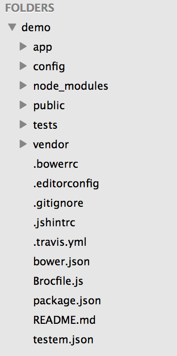
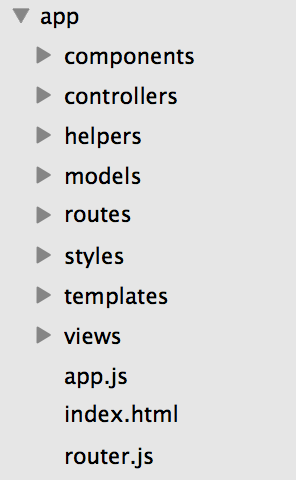

# PITHOS UI

---

## OLD PITHOS

* Last feature 2012
* Mixed html + java
* Code is not maintained
* Much effort to change something
* Old html markup (table design)

---

## NEW PITHOS 
(??)
> Pithos is a javascript web application taking advantage 
> of Pithos API inside a Django project

---

## NEW PITHOS

* Django (??)
* Ember.js
* Ember data
* Foundation

---

## TECHNOLOGIES

* JavaScript, ES6
* node.js
* Python
* sass

---

## FRAMEWORKS

* Ember.js
* Django
* Foundation Zurb
* Ember data
* Qunit

---

## LIBRARIES

* Handlebars
* Underscore
* Font Awesome

---


## TOOLS

* npm
* bower
* compass
* broccoli
* Ember chrome inspector
* babel
* Ember cli

---
<!-- .slide: data-background-class="ember" -->
## EMBER.JS

> A Javascript MVC framework for creating ambitious web applications.


---
<!-- .slide: data-background-class="ember" -->

## EMBER.JS 

#### Core concepts

- Templates
- Component
- Controller
- Model
- Route
- The route

---
<!-- .slide: data-background-class="ember" -->

## EMBER.JS 

#### Templates

```handlebars
<ul>
    {{#each person in people}}
        {{person.name}}
    {{/each}}
</ul>
{{#if admin}}Yes, master.{{/if}}
<div>
    {{input type="text" value=name placeholder="Enter your name"}}
</div>
<div class="text">
    <h3>My name is {{name}} and I want to learn Ember!</h3>
</div>
```

---
<!-- .slide: data-background-class="ember" -->

## EMBER.JS 

#### Components

```javascript
// components/gravatar-image.js
export default Ember.Component.extend({
  email: '',

  gravatarUrl: Ember.computed('email', function() {
    var email = this.get('email');
    return 'http://www.gravatar.com/avatar/' + md5(email) + '?s=200';
  })
});
```

```handlebars
<!-- application.hbs -->
{{gravatar-image email="foo"}}
```

```handlebars
<!-- templates/components/gravatar-image.hbs -->

```


---
<!-- .slide: data-background-class="ember" -->

## EMBER.JS 

#### Controllers

```javascript
// controllers/application.js
export default Ember.Controller.extend({
  search: '',

  actions: {
    query() {
      // the current value of the text field
      var query = this.get('search');
      this.transitionToRoute('search', { query });
    }
  }
});
```
---
<!-- .slide: data-background-class="ember" -->

## EMBER.JS 

#### Models


```javascript
// models/container.js
export default DS.Model.extend({
  name: DS.attr('string'),
  project: DS.belongsTo('project', {async:true}),
  objects: DS.hasMany('object', {async:true}),
  bytes: DS.attr('number', {defaultValue: 0}),
  last_modified: DS.attr('date'),
  versioning: DS.attr('string'),

  last_modified_human: function(){
    return timeHuman(this.get('last_modified'));
  }.property('last_modified'),

  isTrash: function(){
    return this.get('name').toLowerCase() == 'trash';
  }.property('name'),
});
```
---
<!-- .slide: data-background-class="ember" -->

## EMBER.JS 

#### Routes

```javascript
// routes/account.js
import Ember from 'ember';

export default Ember.Route.extend({
  model: function(){
    return this.store.find('account');
  },
});
```


---
<!-- .slide: data-background-class="ember" -->

## EMBER.JS 

#### The router


```javascript
// router.js
Router.map(function() {
  this.resource('index', {path: '/'});
  this.resource('containers');

  this.resource('account', {path: '/shared/accounts'}, function() {
    this.route('container', {path: '/:account'}, function() {
      this.route('objects', {path: '/:container_name/*path'});
      // *path wont match an initial url with no path set 
      this.route('objects_redirect', {path: '/:container_name'});
    });
  });

  this.resource('container', { path: '/containers/:container_name'}, function(){
    this.resource('objects', { path: '/*current_path'}, function(){
      this.resource('object', { overrideNameAssertion: true }, function(){
        this.route('versions');
      });
    });
  });
  this.resource('errors/404', {path: '*path'});
});
```
---

## Development needs

- compile
- watch
- install, manage and track packages/dependencies
- concat, minify
- precommit hooks
- check/ control coding style (jshint, k auto t sass)
- other tasks/script (destination/paste of output)
- asset pipeline (??)

---

## Ember-cli

> A tool for creating ember apps

```bash
# Installation
$ npm install -g ember-cli  

# Start a new project
$ ember new demo

# Run server
$ ember serve

# Generate new route
$ ember generate route bar
```


--- 
## Ember-cli

### Project layout


--- 
## Ember-cli

### Project layout


--- 

## Difficulties

1. API not following conventions [http://jsonapi.org/format/](jsonapi format)
2. Objects vs human friendly folder structure
3. Error handling

---

## Difficulties

3. API not following conventions [http://jsonapi.org/format/](jsonapi format)


```javascript
// Ember way
var groups = this.store.find('groups');

// Pithos API way
ajaxSuccess: function(jqXHR, jsonPayload) {
    // get all headers as a string
    var headersStr = jqXHR.getAllResponseHeaders();
    var headers = headersStr.split('\n');

    // remove the colon and the uuids of the members of each group
    var re = (/X-Account-Group-\S*(?=:)/g);
    var groupHeader, groupName, groups=[];

    if(headersStr.indexOf('X-Account-Group-') > -1) {
        headers.forEach(function(h) {
            groupHeader = h.match(re);

            if(groupHeader) {
                var group = {};
                group.id = decodeURIComponent(groupHeader[0].replace('X-Account-Group-', ''));
                group.name = group.id;
                var uuids = jqXHR.getResponseHeader(groupHeader[0]);
                if(uuids === '~') { return }
                if(uuids) {
                    group.users = uuids.split(',');
                } else {
                    group.users = [];
                }

                groups.push(group);
            }
        });
        jsonPayload.groups = groups;
    }
    return jsonPayload;
},
```

---


## Design

- Foundation zurb framework
- No designer 
- Concepts: UX principles, Simple intuitive design, error handling

---

## Pending issues

- Responsive Design
- Write tests
- Issues: https://github.com/olgabrani/synnefo/issues
- More user testing

---

## FUTURE PLANS

- Handle files (video players, audio players).
- Various enhancements (github issues tagged with #enhancement).
- Node webkit (??)
- Global styleguide
---

# Demo
